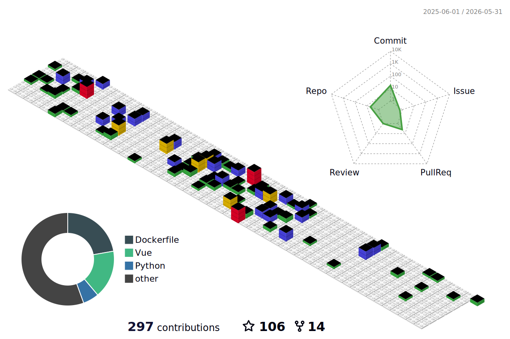

## Hi there 👋
<div align="center">
<span>  </span>
<span>        </span>
<span>  </span>
</div>
<div align="center">

<!--START_SECTION:waka-->

```txt
Python                     196 hrs 1 min         ████████▒░░░░░░░░░░░░░░░░   33.13 %
Vue.js                     83 hrs 39 mins        ███▓░░░░░░░░░░░░░░░░░░░░░   14.14 %
Other                      66 hrs 52 mins        ██▓░░░░░░░░░░░░░░░░░░░░░░   11.30 %
JavaScript                 42 hrs 31 mins        █▓░░░░░░░░░░░░░░░░░░░░░░░   07.19 %
TypeScript                 41 hrs 43 mins        █▓░░░░░░░░░░░░░░░░░░░░░░░   07.05 %
```

<!--END_SECTION:waka-->
</div>


