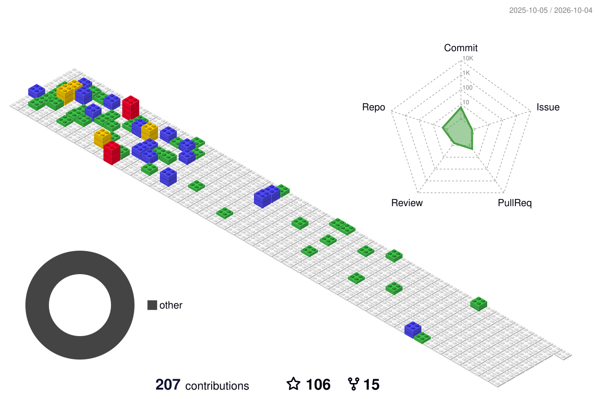

## Hi there 👋
<div align="center">
<span>  </span>
<span>        </span>
<span>  </span>
</div>
<div align="center">

<!--START_SECTION:waka-->

```txt
Python                     226 hrs 11 mins       █████████▒░░░░░░░░░░░░░░░   37.98 %
Markdown                   49 hrs 18 mins        ██░░░░░░░░░░░░░░░░░░░░░░░   08.28 %
Other                      43 hrs 15 mins        █▓░░░░░░░░░░░░░░░░░░░░░░░   07.27 %
JavaScript                 41 hrs 5 mins         █▓░░░░░░░░░░░░░░░░░░░░░░░   06.90 %
TypeScript                 37 hrs 24 mins        █▓░░░░░░░░░░░░░░░░░░░░░░░   06.28 %
```

<!--END_SECTION:waka-->
</div>


